# Capstone Project: Shoe Image Classifer and Logo Detector

Outline
- [Problem Statement](#Problem-Statment)
- [EDA](#EDA)
- [Modelling](#Modelling)
    - [Transfer learning model `MobileNetV2`](#Transfer-learning-model-MobileNetV2)
    - [Object Detection using `YOLOv5`](#Object-Detection-using-YOLOv5)
- [Evaluation](#Evaluation)
- [Deployment](#Deployment)
- [Conclusion](#Conclusion)

## Problem Statement

Product listings of counterfeit shoes are commonly found on major online marketplaces either as fake listings or advertisements. They generally use images of the actual product, and are sold at a very low price. To detect these listings/ads, the aim is to build a model to classify the images of shoes from popular brands and detect the logos accurately. When combined with a selling price below a preset threshold, they can be proactively blocked from being posted/displayed in the search results and also allow for flagging of suspicious fake product listings for review by the online merchant. The metrics for evaluating the image classifier and logo detector models are accuracy, and mean average precision (mAP) respectively.

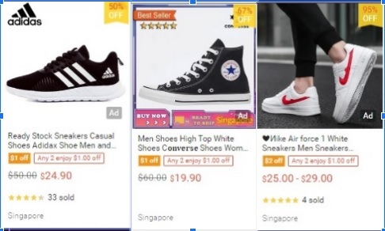

## EDA

The image [dataset](https://www.kaggle.com/datasets/die9origephit/nike-adidas-and-converse-imaged) of shoes from popular brands
was obtained from Kaggle which consists of web images from Google images. It contains 2 folders: one with the train data and the other one with test data.
The train-test-split ratio is 0.14, with the test dataset containing 114 images and the train dataset containing 711.
The images have a resolution of 240x240 pixels in RGB color model.
Both the folders contain 3 classes:

- Adidas
- Converse
- Nike

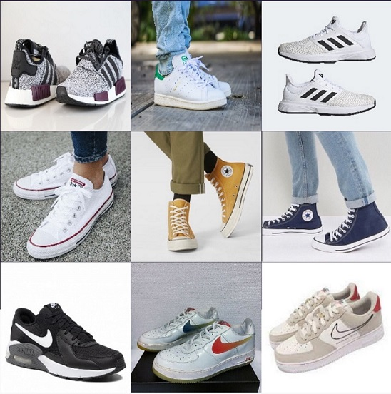

- From the images of Adidas, Converse and Nike shoes, designs of the 3 brands are quite unique, hence we can expect to have a good separation of the shoe images. 
- The 3 brand logos, we expect Converse to be the highest accuracy in detection as it has the most distinct shape, a star in a circular shape. Adidas and Nike logos are expected to follow closely behind Converse. Nike may outperform Adidas in terms of detection accuracy as the 'tick' is more unique compared to '3 stripes'. The '3 stripes' could be misled by similar rectangular shapes in the shoe design

## Modelling
- Image Classification - Using pretrained transfer learning model MobileNetV2 to train a model to classify shoe images for the 3 brands. Model will be evaluated using accuracy 
- Custom Object Detection - Train a custom YOLOv5 model to recognize the objects(logos) in our dataset. Model will be evaluated using mean average precision (mAP)

### Transfer learning model `MobileNetV2`

- Our image classifier model consist of a pre-trained model and last layer which will be retrained to recognise images in our dataset
- The pre-trained transfer learning model is selected from the available ones in tensorflow keras based on the following criteria (i) inference time, (ii) accuracy, (iii) size
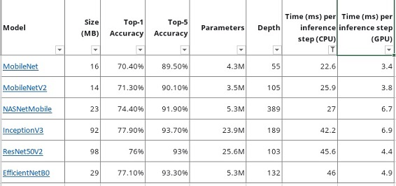
- MobileNetV2 is the most suitable, with the shortest inference time, highest accuracy and small size

#### Model Training and Results

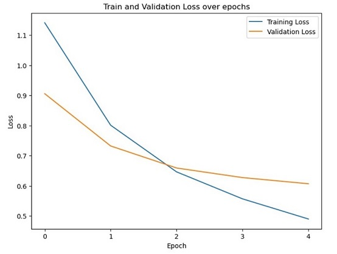
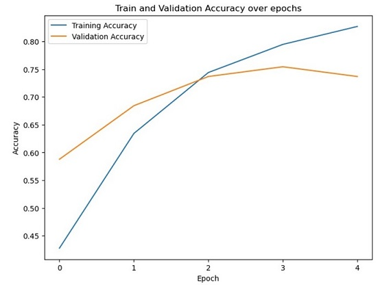

The image classifier model's validation loss saturate at 0.6 after 5 epochs, and has validation accuracy of 0.73

### Object Detection using `YOLOv5`

There are 2 main family of object detection models, two stage methods which have the highest detection accuracy but typically slower, and one stage methods which prioritise inference speed. The most popular benchmark for comparing different object detection models is the Microsoft COCO dataset. The models are typically evaluated according to a mean Average Precision (mAP) metric. One stage methods are more suitable for our use and we will select a suitable one, based on a good mAP and inference time. Among the popular models, [YOLOv5](https://github.com/ultralytics/yolov5) which was released in 2020 is selected. 

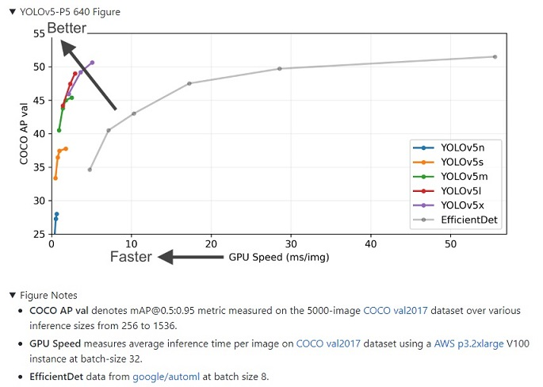

**mean Average Precision(mAP)**

The metric for Object Detection is mAP which is equal to the average of the Average Precision(AP) across all classes in a model. mAP is measured between 0 and 1. 

Summary of steps to determine mAP:

1. Intersection over Union (IoU)

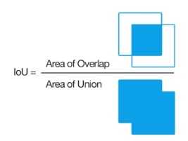

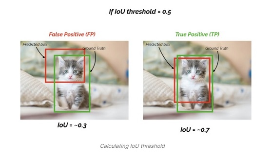

2. Calculate the Confusion Matrix

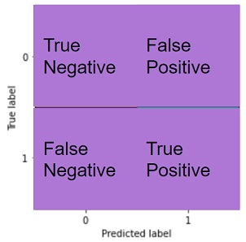

- True Positives (TP):  The model predicted a label and matches correctly as per ground truth.
- True Negatives (TN): The model does not predict the label and is not a part of the ground truth.
- False Positives (FP): The model predicted a label, but it is not a part of the ground truth (Type I Error).
- False Negatives (FN): The model does not predict a label, but it is part of the ground truth. (Type II Error).

3. Calculate Precision & Recall

- Precision = TP/(TP + FP)

- Recall = TP/(TP + FN)

4. Calculate AP from area under Precision-Recall(P-R) plot

The precision and recall values are plotted at each IoU threshold

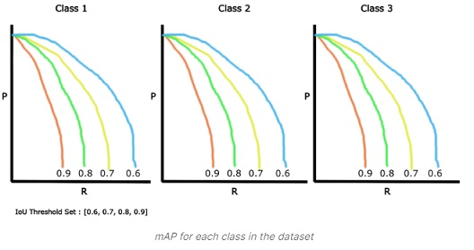

Finally, for each class k, we calculate the mAP across different IoU thresholds, and the final metric mAP across test data is calculated by taking an average of all mAP values per class

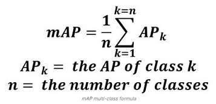

[Source](https://www.v7labs.com/blog/mean-average-precision)

---

Next, we will train a custom YOLOv5 model to recognize the objects(logos) in our dataset. 

To do so we will take the following steps:

Data Preparation
- Use the dataset of images in our image classification model
- Label our dataset by manually drawing the bounding boxes using Roboflow annotate
- Apply data augmentation 
- Export our dataset in YOLOv5 PyTorch format

Modelling
- Train YOLOv5 to recognize the objects(logos) in our dataset
- Evaluate our YOLOv5 model using Tensorboard

#### Data Preparation

In order to train our custom model, we need to assemble a dataset of representative images with bounding box annotations around the objects that we want to detect. 
Total 56 images of Adidas, Converse and Nike shoes are uploaded to Roboflow. Using [Roboflow Annotate](https://docs.roboflow.com/annotate), the images are annotated in YOLO v5 PyTorch format by manually drawing bounding boxes over the logos 

The following pre-processing was applied to each image:
* Auto-orientation of pixel data (with EXIF-orientation stripping)
* Resize to 640x640 (Stretch)

The following augmentation was applied to create 3 versions of each source image:
* Random rotation of between -15 and +15 degrees

We have a total of 133 images after the preprocessing and data augmentation

The trials were repeated with a different combination of the preprocessing and data augmentation steps. Total of 7 trials were conducted and the best combination is the one using all the steps listed

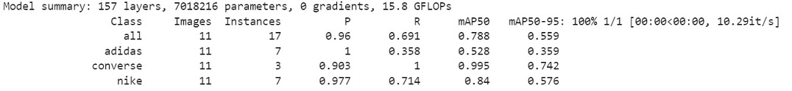

#### Evaluate Custom `YOLOv5`
Training losses and performance metrics are saved to Tensorboard and also to a logfile.

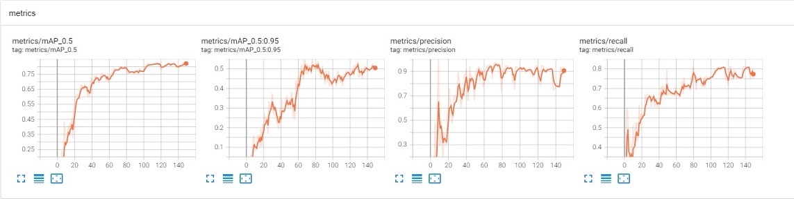

The metrics for object detection is `mAP_0.5` 

- `mAP_0.5` for all class saturated at 0.78 after 150 epochs
- From the model summary, we can see that Converse has the highest `mAP_0.5` of 0.99, followed by Nike of 0.84 and Adidas of 0.52 which match our hypothesis in the EDA section

## Evaluation

- Both the classification and object detection models are evaluated using some test images with the app below (Refer to deployment section)

## Deployment

**Description of app flow**

- User input: Users upload shoe images, and click the predict button
- Process: The model will process the uploaded images and predict the brand of the shoes based on the image classification model and detect the brand logos using the custom trained object detection model
- Output: The predicted brand name and associated probability, brand logos with bounding boxes and confidence

[Click for web app](https://huggingface.co/spaces/pateriti/shoe-image)

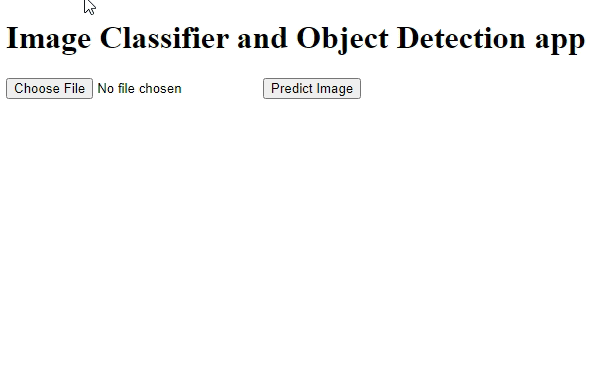

## Conclusion
- Our project have successfully deployed an image classification model to classify shoe images with accuracy of 0.73, and a custom object detection model to detect logos with `mAP_0.5` of 0.78. When combined with a selling price below a preset threshold, the listings of counterfeit shoes/advertisements can be proactively blocked from being posted/displayed in the search results and also allow for flagging of suspicious product listings for review by the online merchant. 
- It is recommended to use predictions from both models for our use case, with more weightage given to the logo detector as it has a better metric

**Future work**
- Improve on preprocessing. Auto background removal
- More tuning on the weightage from each models
- More image data

